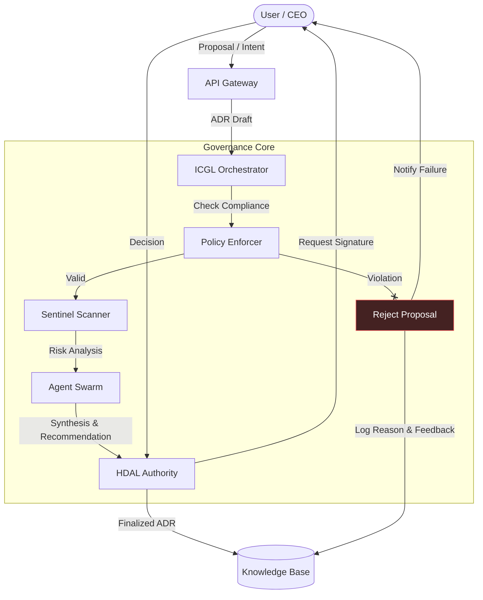
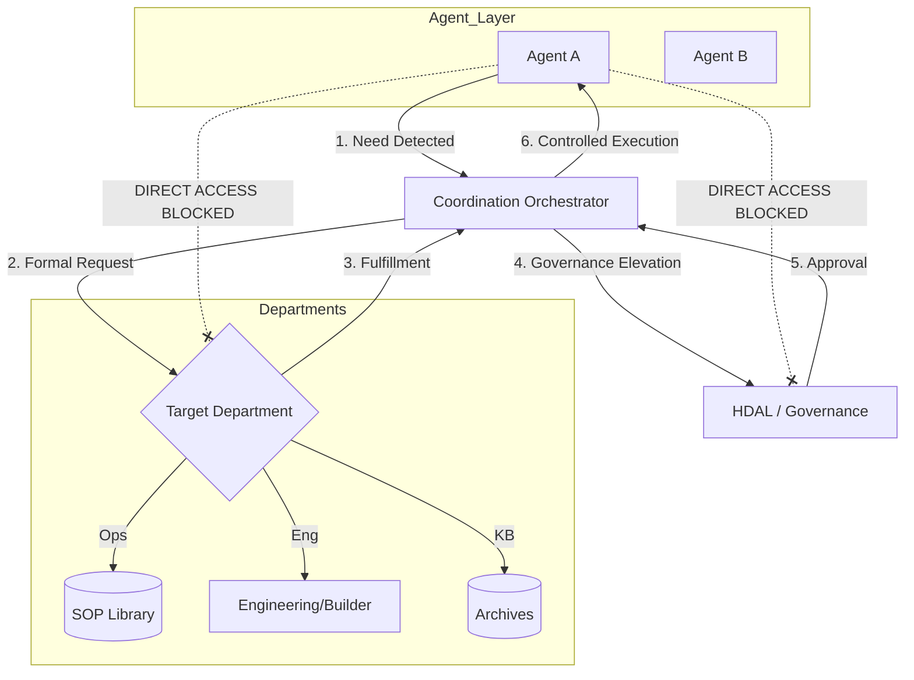
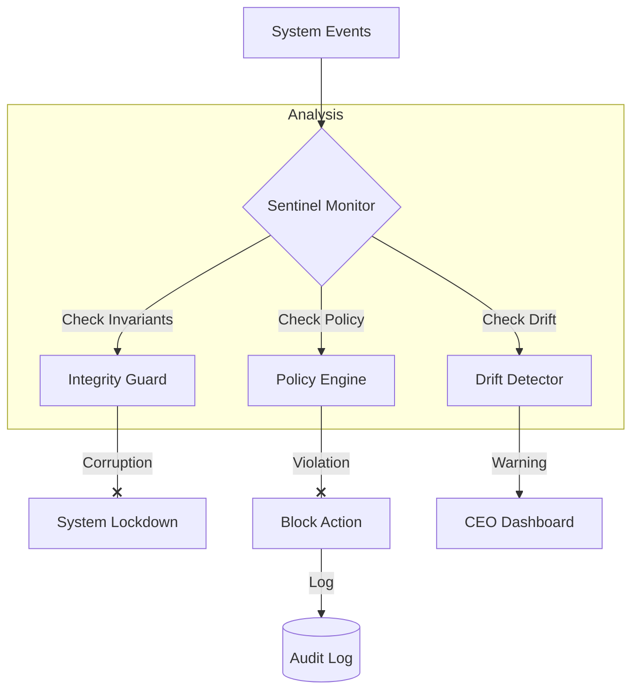
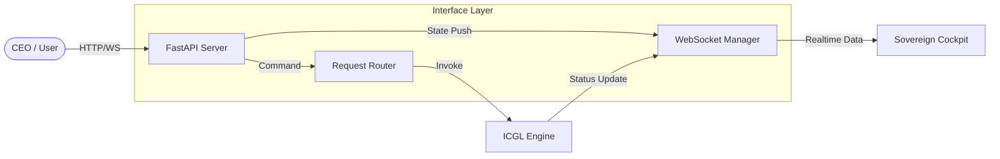

# 📊 Departmental Data Flow Diagrams (DFD) Submission

**To:** Office of the CEO  
**From:** System Architect  
**Date:** 2026-01-17  
**Status:** CANONICAL ARCHITECTURE - CYCLE 2026.2 (IDCP Active)  

Per your directive and strategic feedback, these data flows have been formally established. They incorporate explicit Rejection Traceability, Authority Constraints for persistence, and governed write-access for the file system.

---

## 1. Governance Department (HDAL & Orchestrator)

**Responsibility:** Decision making, Policy enforcement, and Cycle management.

---

## 2. Knowledge Base Department (Archives)

**Responsibility:** Storing Truth, Policies, Memories, and Procedures.

```mermaid
graph LR
    Input[Incoming Entity] -->|Validate Schema| Validator{Schema Validator}
    
    Validator --x|Invalid| Error[Return Error]
    Validator -->|Valid| Persist[Persistence Layer]
    
    subgraph Storage
        Persist -->|SQL| SQLite[(SQLite DB)]
        Persist -->|Vectors| Qdrant[(Vector Memory)]
    end
    
    subgraph Access
        Query[Search/Get] --> Cache[Memory Cache]
        Cache -.->|Miss| SQLite
        Cache -.->|Semantic| Qdrant
    end
    
    SQLite --> Output[Data Object]
    Qdrant --> Output

    %% Authority Note
    subgraph Authority_Constraint [ ]
        direction LR
        Note1[<b>AUTHORITY:</b> Only Governance Core<br/>can Persist Canonical Records]
    end
    Authority_Constraint --- Persist
    style Authority_Constraint fill:#221,stroke:#660,stroke-dasharray: 5 5
```

---

## 3. Operations Department (Agents & Coordination)

**Responsibility:** Execution, self-sufficiency via protocol, and inter-department requests.

**IDCP Constraints:**

- **Zero-Bypass:** Every agent need MUST flow through the Orchestrator.
- **Traceability:** Every request is logged in the KB before execution.
- **Authority:** No department fulfills until Governance signs the result mapping.

---

## 4. Security & Compliance Department (Sentinel)

**Responsibility:** Drift detection, Integrity checks, and Real-time monitoring.

---

## 5. Interface Department (Cockpit & API)

**Responsibility:** User interaction, Visualization, and Command intake.

---

**Action Required:**
Please review these flows. If approved, they will become the "Canonical Architecture" for the next cycle.
